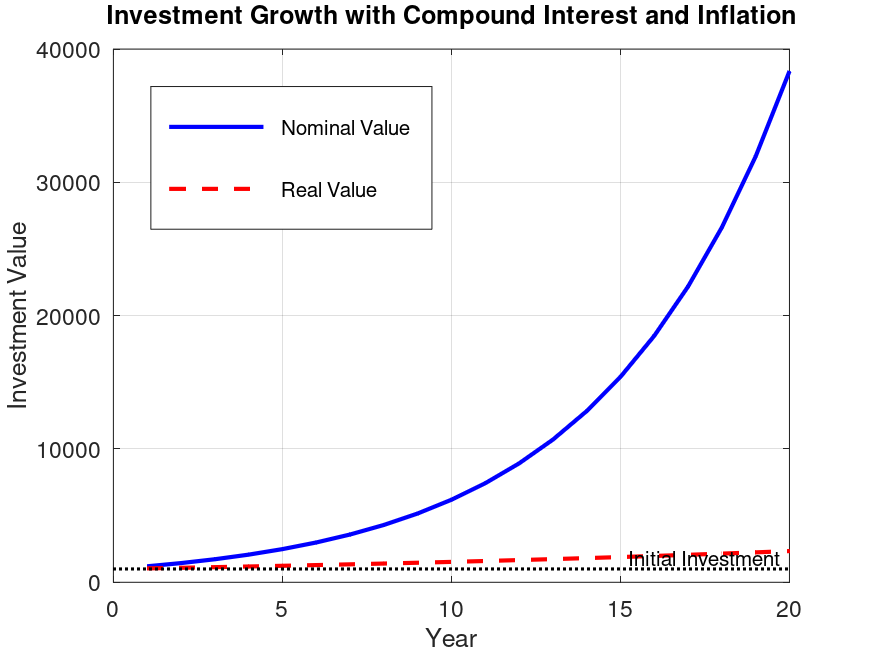

# Investment Growth Simulation (GNU Octave)

A GNU Octave project that simulates the growth of an investment using **compound interest** while considering the effect of **annual inflation**.

---

## Project Overview

The program computes both the **nominal** value of an investment and its **real (inflation-adjusted)** value over a specified number of years.

The implementation demonstrates:

* User-defined functions
* `for` loops
* Recursive mathematical modeling
* Matrix operations
* Data visualization with `plot`
* Exporting figures as PNG images

---

## Mathematical Model

Let

* $P_0$ = Initial investment
* $r$ = Annual interest rate
* $f$ = Annual inflation rate

### Nominal Value

$$
P_n = P_{n-1}(1+r)
$$

### Real Value

The real value is computed recursively as

$$
R_n = R_{n-1}\frac{1+r}{1+f}
$$

which is equivalent to

$$
R_n=\frac{P_0(1+r)^n}{(1+f)^n}
$$

---

## Example Parameters

| Parameter          |    Value |
| ------------------ | -------: |
| Initial Investment |     1000 |
| Interest Rate      |      20% |
| Inflation Rate     |      15% |
| Duration           | 20 years |

---

## Project Structure

```text
.
├── run_investment.m
├── simulate_investment.m
├── investment_growth.png
└── README.md
```

---

## Output

The generated figure compares:

* **Nominal Investment Value**
* **Real Investment Value (Inflation Adjusted)**

### Simulation Result



---

## How to Run

Execute the main script in GNU Octave:

```octave
run_investment
```

The program will:

1. Simulate the investment growth.
2. Display the plot.
3. Save the figure as `investment_growth.png` with **150 dpi** resolution.

---

## Concepts Covered

* Functions
* `for` loops
* Recursive algorithms
* Matrix indexing
* Data visualization
* Figure exporting
