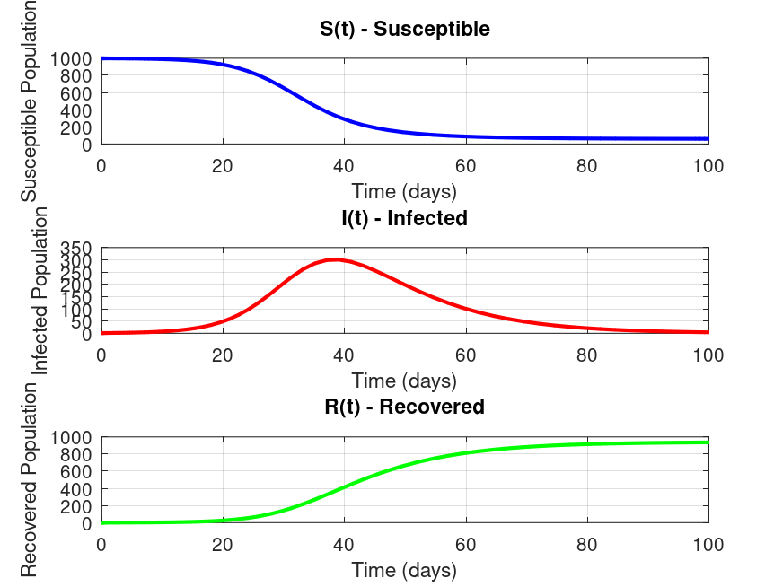

# 🦠 Epidemic Outbreak Modeler (Challenge 4)

A numerical implementation of the classic **Susceptible–Infected–Recovered (SIR)** epidemic model using MATLAB's `ode45` ODE solver. This project was completed as part of a programming challenge and demonstrates solving ordinary differential equations, data visualization, and exporting simulation results.

---

## 📚 Table of Contents

- [Mathematical Model](#mathematical-model)
- [Project Structure](#project-structure)
- [Implementation Details](#implementation-details)
- [Tasks Completed](#tasks-completed)
- [Simulation Results](#simulation-results)
- [How to Run](#how-to-run)
- [Output Files](#output-files)
- [Example Console Output](#example-console-output)
- [Dependencies](#dependencies)
- [License](#license)

---

## 🧮 Mathematical Model

The SIR model divides a **closed population** of **N = 1000** into three compartments:

| Compartment | Description | Initial Value |
|-------------|-------------|--------------:|
| **S** | Susceptible | 999 |
| **I** | Infected | 1 |
| **R** | Recovered | 0 |

The model is governed by the following system of ordinary differential equations:

```text
dS/dt = -β · S · I
dI/dt =  β · S · I - γ · I
dR/dt =  γ · I
```

**Parameters**

- Transmission rate: **β = 0.0003**
- Recovery rate: **γ = 0.1**

> **Note:** The transmission coefficient is scaled for a population of 1000, so the implementation does not explicitly divide the infection term by **N**.

---

## 📁 Project Structure

```text
.
├── main_script.m
├── sir_model.m
├── README.md
├── sir_plot.png
└── sir_results.csv
```

---

## ⚙️ Implementation Details

### 1. ODE Function — `sir_model.m`

- Accepts the current time `t` and state vector `y = [S; I; R]`.
- Returns the derivatives as a column vector.
- The parameters `β` and `γ` are defined inside the function, following the challenge requirements.

```matlab
function dydt = sir_model(t, y)
    beta = 0.0003;
    gamma = 0.1;

    dydt = zeros(3,1);
    dydt(1) = -beta * y(1) * y(2);
    dydt(2) =  beta * y(1) * y(2) - gamma * y(2);
    dydt(3) =  gamma * y(2);
end
```

### 2. Main Script

The main script:

- Defines the initial conditions and simulation interval (`0`–`100` days).
- Solves the system using `ode45`.
- Extracts the `S`, `I`, and `R` trajectories.
- Generates three vertically stacked subplots with titles, axis labels, and grids.
- Saves the figure as `sir_plot.png` (150 DPI).
- Finds the epidemic peak using `max(I)`.
- Exports the simulated time series to `sir_results.csv`.

---

## ✅ Tasks Completed

- [x] Implement the SIR model in `sir_model.m`.
- [x] Solve the system over a 100-day simulation using `ode45`.
- [x] Plot `S(t)`, `I(t)`, and `R(t)` using three subplots.
- [x] Compute and display the epidemic peak using `max`.
- [x] Export the simulation results to a CSV file.

---

## 📊 Simulation Results

The simulation illustrates the typical progression of an epidemic:

- The susceptible population decreases as individuals become infected.
- The infected population rises to a peak before declining.
- The recovered population increases monotonically, representing individuals who acquire permanent immunity in this simplified model.

The epidemic peak (maximum number of infected individuals) is computed automatically and displayed in the console.

The exported `sir_results.csv` file contains the complete simulated time series for further analysis.

### 📈 Generated Plot



*Three subplots showing the susceptible, infected, and recovered populations over time.*

---

## 🚀 How to Run

1. Clone the repository or copy all project files into the same directory.
2. Open **MATLAB** or **GNU Octave**.
3. Run:

```matlab
main_script
```

The program will:

- Solve the SIR model.
- Display the epidemic peak in the console.
- Save `sir_results.csv`.
- Save `sir_plot.png`.

---

## 📦 Output Files

| File | Description |
|------|-------------|
| `sir_results.csv` | Simulated time series containing `[t, S, I, R]`. |
| `sir_plot.png` | Figure containing the three simulation subplots. |

---

## 💬 Example Console Output

```text
Example output:

The epidemic peaks at day 39.05 with 300.53 infected individuals.
Simulation completed. Results saved to sir_results.csv
Plot saved as sir_plot.png (150 DPI).
```

---

## 🛠️ Dependencies

- MATLAB (any recent version) or GNU Octave
- No additional toolboxes are required.

The project uses only built-in functions:

- `ode45`
- `subplot`
- `plot`
- `fprintf`
- `max`
- `csvwrite`

> **Note:** `csvwrite` is used to satisfy the challenge requirements. For modern MATLAB projects, `writematrix` is generally recommended.

---

## 📄 License

This project was created for educational purposes as part of **Challenge 4 – Epidemic Outbreak Modeler**.
